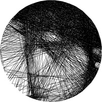

# image2seq

用圆周锚点之间的弦线，将灰度图近似还原为绕线画（String Art）。

 

## 算法概述

1. 在画布边缘圆周上均匀放置锚点（默认 180 个）
2. 从当前锚点出发，选一条弦线画到下一个锚点
3. 重复上述步骤，输出锚点访问序列 `sequence`

物理模型采用 **块覆盖率 + 不透明 union**（参考 String Art 论文思路）：

- 真实黑线**不透明**：同一位置重叠不会变更黑
- 灰度由**局部覆盖率**决定：一个 block 内被线盖住的子像素比例 ≈ 目标灰度
- 高分辨率模拟（`block_size` 倍）+ 低分辨率目标图对比

优化策略（默认 **Beam Search + 多起点**）：

- **Greedy**：每步选误差下降最大的弦，速度快
- **Beam**：保留 top-k 条候选路径，缓解贪心短视
- **Multi-start**：从多个起点各跑一遍，取最优结果

## 快速开始

```bash
python3 -m venv .venv
source .venv/bin/activate   # Windows: .venv\Scripts\activate
pip install -r requirements.txt

python main.py portrait.jpg -o output
```

## 命令行参数

| 参数 | 默认值 | 说明 |
|------|--------|------|
| `input` | — | 输入图像路径 |
| `-o, --output` | `output` | 输出目录 |
| `--radius` | `100` | 锚点圆半径（图像尺寸 = 2r+1） |
| `--anchors` | `180` | 圆周锚点数量 |
| `--block-size` | `8` | 覆盖率 block 缩放倍数 |
| `--line-width` | `2` | 线宽（高分辨率像素） |
| `--max-iter` | `5000` | 最大线数 |
| `--metric` | `l2` | 覆盖率误差：`l1` / `l2` |
| `--importance` | `3.0` | 边缘权重（0 关闭） |
| `--strategy` | `beam` | 优化策略：`greedy` / `beam` |
| `--beam-width` | `8` | Beam Search 宽度 |
| `--num-starts` | `4` | 多起点数量 |
| `--candidate-pool` | `60` | 每步采样候选数（0 = 全部） |
| `--min-improvement` | `0.01` | 低于此改进量可停止 |
| `--min-lines` | `0` | 最少线数（未达不提前停） |
| `--seed` | `42` | 随机种子 |
| `--progress` | `500` | 进度打印间隔（0 关闭） |

### 示例

```bash
# 质量优先（默认）
python main.py portrait.jpg -o output --strategy beam --beam-width 6 --num-starts 2

# 速度优先
python main.py portrait.jpg -o output --strategy greedy --num-starts 1 --candidate-pool 0
```

## 输出

| 文件 | 说明 |
|------|------|
| `render.png` | 渲染预览 |
| `target.png` | 缩放后的目标图 |
| `sequence.npy` | 锚点序列 `(N, 2)`，坐标为 `(row, col)` |
| `coverage.npy` | 低分辨率覆盖率图 |
| `summary.txt` | 迭代数、最终误差 |

## 项目结构

```
image2seq/
├── main.py                 # CLI 入口
├── requirements.txt
└── image2seq/
    ├── physics/            # 物理层：线怎么盖、覆盖率怎么算
    │   ├── protocol.py     # LineSimulator 接口
    │   ├── lines.py        # Bresenham 光栅化
    │   └── simulator.py    # BlockCoverageSimulator
    ├── optimizer/          # 优化层：选哪条线
    │   ├── greedy.py
    │   ├── beam.py
    │   ├── multi_start.py
    │   └── factory.py
    ├── types.py            # 配置与结果类型
    └── io.py               # 图像读写、结果保存
```

物理层与优化层通过 `LineSimulator` 接口解耦，可独立替换物理模型或搜索策略。

## 参考

- [Birsak et al. 2018 — String Art](https://doi.org/10.1111/cgf.13359)
- [Demoussel et al. 2022 — A Greedy Algorithm for Generative String Art](https://hal.science/hal-03901755)
